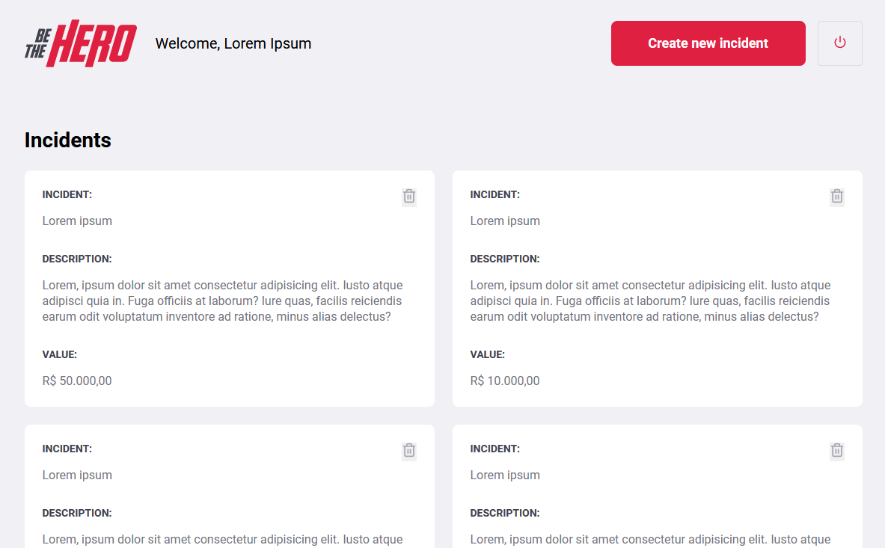

# Be The Hero - Omnistack 11 (Rocketseat)

 

  

  <a href="#-technologies">Technologies</a>&nbsp;&nbsp;&nbsp;|&nbsp;&nbsp;&nbsp;
  <a href="#-project">Project</a>&nbsp;&nbsp;&nbsp;|&nbsp;&nbsp;&nbsp;
  <a href="#-license">License</a>

## 🚀 Technologies

This project was build using the following technologies:

- [Node.js](https://nodejs.org/en/)
- [React.js](https://reactjs.org)

## 💻 Project
Be The Hero is a project to connect people who wants to make monetary contributions to NGOs (Non-Governmental Organizations) that needs help

## 📝License

This project is under MIT License. Check the file [LICENSE](LICENSE.md) for more details.
\
\
\

